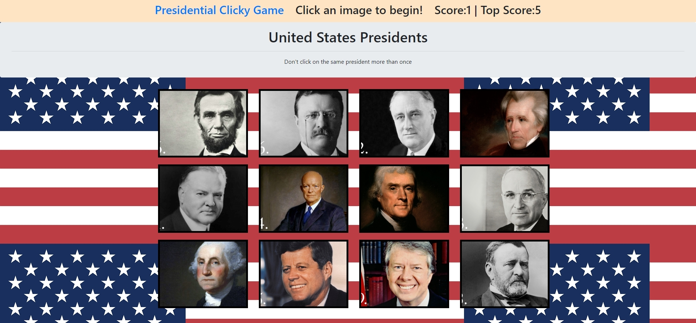

# Presidential Memory Game!

## About

This application uses facebook's ReactJs front end framework to create a dynamically updating memory game. The user will be shown a list of 12 presidents. Once the user clicks an image, the game begins. Each time the user clicks, the 12 images will shuffle randomly on the screen. To win the game, the user must click on all 12 different images without clicking the same president twice. When an image is clicked twice the score will be reset to zero, however, the game will always keep track of the highest score achieved. This app utilizes react's virtual dom functionality to only update components that are displaying new data, rather than refreshing everything, leading to boosts in performance.

## Demo

[Click Here](https://clicky-game-278.netlify.com/) to view the application

## Requirements

*[React](https://reactjs.org/)

## Build Tools

* HTML

* CSS

* Javascript

* ES6

* ReactJs

* Netlify